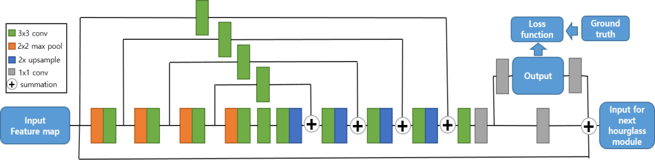
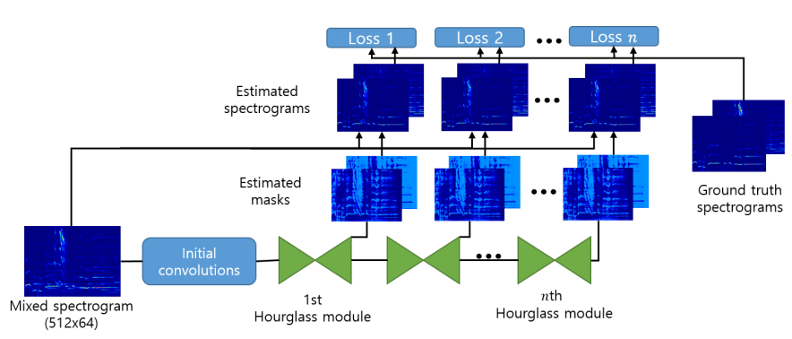

# 音源分离作业报告

 计65 赵鋆峰 2016011373 

 软63 吾尔拉 2016013245 

## 算法原型

我们采用的算法原型为Park[^1]使用的基于堆叠沙漏网络的音源分离。具体方法为：

先用STFT将输入的波形数据转化为二维时频数据，然后就可以用类似CV的那一套方法对二维数据进行卷积提特征等操作。而该文用的是CV领域中提出来的被用于人体姿态检测的Stacked hourglass networks[^4]（即堆叠沙漏网络）。其整体是由若干个沙漏结构堆叠而成，其中单个沙漏模块的结构图如下：

​	

单个沙漏模块的结构图

主要作用是通过不断地卷积、池化、上采样、再卷积这样的一个FCN[^7]结构，来实现"像素级"的"语义分割"。而基于遮罩的音源分离就是这样一个任务：针对每一个位置上的"像素"，输出一个比例，表示输入的混合音源在该位置中属于人声/伴奏的比例。而堆叠沙漏网络则是将前一个沙漏的输出作为后一个沙漏的输入，通过级联的方式进一步扩大网络的能力，将网络更加精细化。本文中采用的堆叠沙漏网络结构如下：

算法整体的框架

比较特别的是这个网络会输出多组预测的遮罩，而计算loss的时候也是多组预测遮罩的loss之和。我们的理解是这某种意义上也是一种Resnet中的skip-connection，使得随着层数的加深，网络的能力只会增加而不会减少。论文中也验证了4个沙漏确实会比1、2个沙漏的最终分离效果的评价指标普遍要高。我们的实现也follow了论文选择了4个沙漏进行堆叠。

## 实现细节

 [^1]作者提供了算法的Tensorflow实现[^2]，我们则基于Pytorch重新复现了整个工作，实现中还参考了[^4]的源代码，并且在实现中发现一些可能可以优化的点，并尝试做了改进，部分收到了一定的成效（所有实验记录存放在result.xlsx文件中）。

### 速度

在评测算法性能时，原文章采用了每次只放一段音频进网络进行一次前向传播去获得分离结果，而由于pytorch本身自带的mini-batch结构，我们可以很容易地一次放batch\_size段数的音频进去，一次前向传播获取所有分离结果，在计算网络方面最高提速达到了4倍（实际使用时不需计算评价指标的话净速度提升可达4倍）；而在最终音源的评价指标计算时，也就是要计算SDR、SIR、SAR等数值时，原文章采用了mir\_eval库中的mir\_eval.separation.bss\_eval\_source，经过尝试，我们采用了museval库中的museval.metrics.bss\_eval\_source可以达到相同的效果（输入输出有些许不同），但速度相较有明显提升。

由于评价指标的计算耗费时间在评测时占大部分（80%）时间，以上两项综合作用到整个测试过程上，使得测试速度提高了40%。

最终转换一条1分4秒的音频在单GTX1060上只需要6秒，具备实现实时音源分离的能力。（实测原实现同样条件需16秒）

### 效果

在关乎算法的效果上，我们做出了几个尝试：

#### 模型改变

在沙漏的基本网络中，作者特意提到了全程使用相同的通道数，也就是说的随着feature map尺寸的缩小，通道数保持不变，这与直觉不符，也与前人的研究成果不符（例如U-Net[^3]以及最开始提出用于人体姿势检测的Stacked hourglass networks[^4]这样类似的FCN结构，都是随着feature map尺寸变小，而feature map的数目（也即通道数）增加），猜测作者可能是为了减少参数而这样做。因此我们在实现中修改了这一设定，转而将第一层的通道数缩小，然后随着feature map尺寸的缩小，通道数也递增。具体参数设置为第一层为64，每经过一次pooling层，通道数加64，每进行一次上采样，通道数减64，这样可以保证每一层的沙漏输入输出通道数保持一致。而原网络则是始终保持256的通道数。

在保持其他条件不变的情况下（训练集、测试集与论文保持一致，以abjones和amy开头的片段共计175段为训练数据，剩下的875段为测试数据） ，两者的效果对比如下：

|模型|网络参数个数|人声NSDR|人声SIR|人声SAR|伴奏NSDR|伴奏SIR|伴奏SAR|
|---|---|---|---|---|---|---|---|
|Ours|**34689752**|10.284|**15.74**|12.254|**9.819**|**14.159**|12.299|
|Park's|42752792|**10.433**|15.426|**12.618**|9.772|13.745|**12.642**|

实验效果表明，我们的模型在参数减少约20%的条件下，效果可以与原模型相当甚至超过。

除此之外，我们也尝试了WAVE-U-NET[^5]中提出的优化：当我们预测音源分离时，需要满足分离出来的源合起来要等于混合源，如果分别学习的话，网络无法学习出这一特性。所以WAVE-U-NET的做法是如果要分成$n$个目标源，那么就让网络去学习其中的$n-1$个，最后用混合源减去这$n-1$个就得到了剩下那个目标源的预测结果。因此对于人声和伴奏的分离，我们尝试了分别只对人声和伴奏进行预测，但是最终效果都不理想：单学人声的话，人声效果还不错，但是人声中没被提取出来的部分就会落到伴奏里就能听到明显的人声；单学伴奏的效果反之。

我们也尝试了不预测遮罩，而是直接end-to-end地去预测分离出来两个音源的时频图，但是也失败了：网络始终输出0，无法正常训练。目前暂时还不知道原因。

在训练数据的选择上，我们也对原文的方法进行了修改。原文是先固定训练次数，然后依次从175条音频中随机选取一个，再随机选取一个合法的开始位置选取固定长度的一段进行模型输入数据的准备。但是实际情况上，训练数据的长度不一，可供训练的数据数目也大不相同（最短的音频只有33个合法的开始位置，而最长的有311个）。这样的结果可能导致每一个可能训练数据在实际训练中被采样到的概率不同。因此我们做了改变：一开始就将所有合法的开始位置放到一个集合里（包含是哪段音频的信息），然后每次迭代都随即从这里面选。这保证了每个训练数据被采样到的概率相同。没有单独进行此项的对比实验，但此项加上学习率从0.1改为0.001在固定训练轮数上使得6项指标均获得了小幅提升，使得我们的测试集评价指标全面超越了Park[^1]，这也是我们得到的效果最好的模型，具体评价指标数据见最终效果。

### 其他

我们除了在完成模型对于MIR-1K数据集的训练和测试，同样提供了对单一输入wav文件进行分离的方法。具体使用方法见运行说明。

## 最终效果

### 指标

最终我们在评价指标上全面超越了Park[^1]，所有的实验结果和参数尝试可以查看result.xlsx。这里仅列出我们的最好结果与论文中的结果比较的结果。

|模型|训练轮数|人声NSDR|人声SIR|人声SAR|伴奏NSDR|伴奏SIR|伴奏SAR|
|---|---|---|---|---|---|---|---|
|Ours' best|15000|10.724|16.6|12.516|**10.03**|**14.95**|**12.426**|
|Ours' best|20000|**10.944**|**17.355**|**12.531**|9.916|14.259|12.601|
|Park's paper|15000|10.51|16.01|12.53|9.88|14.24|12.36|

### 实际分离效果

我们既保留了一些在测试过程中输出的预测的人声和伴奏，放在Samples/目录下；为了与原论文有对比，我们也与Park[^1]的预测结果选取了同样音频做了预测，放在Test/目录下，其中annar\_4.wav为使用sox工具将annar_4_01.wav~annar_4_09.wav拼接起来的一个音频，我们的算法预测得到的人声和伴奏分别为annar_4_voice_predict_ours.wav和annar_4_accompaniments_predict_ours.wav，paper结尾的则是我们用我们的代码堆成和论文一样的结构复现的结果，原文提到的预测结果见[^6]。

## 成员分工

在整个工作的完成过程中，赵鋆峰主要负责代码的实现、改进方案的提出，而吾尔拉主要负责文献调研、服务器租赁和跑实验。

## 运行说明

见README.md。

我们提供了一个训练好的模型model.pt，可以在需要的时候直接加载它。如果是分离单个音频可以直接使用，如果是验证模型在测试集下的指标则需要按照README.md的指示将MIR-1K数据集下载到指定位置方可运行。

[^1]: Sungheon Park, Taehoon Kim, Kyogu Lee, Nojun Kwak, Music Source Separation Using Stacked Hourglass Networks, arXiv:1805.08559 [cs.SD]
[^2]: https://github.com/sungheonpark/music_source_sepearation_SH_net
[^3]: Olaf Ronneberger, Philipp Fischer, and Thomas Brox. U-net: Convolutional networks for biomedical image segmentation. In International Conference on Medical image computing and computer-assisted intervention, pages 234–241. Springer, 2015.
[^4]: Alejandro Newell, Kaiyu Yang, and Jia Deng. Stacked hourglass networks for human pose estimation. In European Conference on Computer Vision, pages 483– 499. Springer, 2016.
[^5]: Stoller, D., Ewert, S., Dixon, S. 2018. Wave-U-Net: A Multi-Scale Neural Network for End-to-End Audio Source Separation.arXiv e-prints arXiv:1806.03185.
[^6]: https://www.youtube.com/watch?v=oGHC0ric6wo&feature=youtu.be
[^7]: Jonathan Long, Evan Shelhamer, and Trevor Darrell. Fully convolutional networks for semantic segmenta- tion. In Proceedings of the IEEE conference on com- puter vision and pattern recognition, pages 3431– 3440, 2015.
[^8]: https://github.com/princeton-vl/pose-ae-train